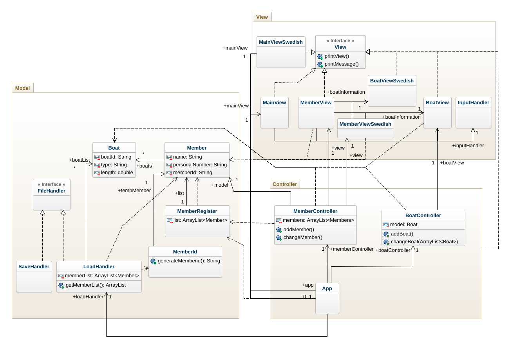
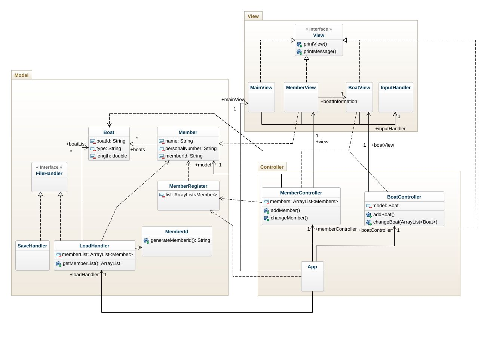
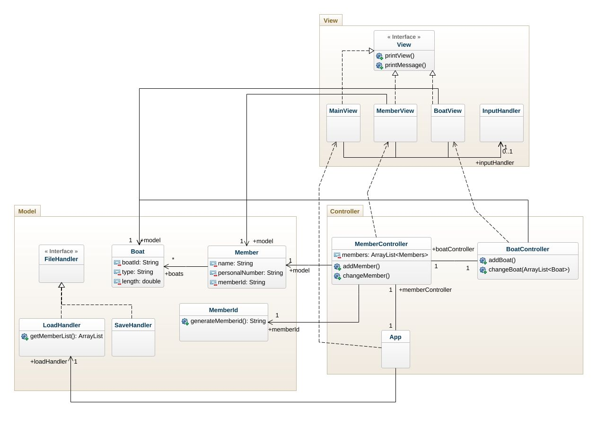
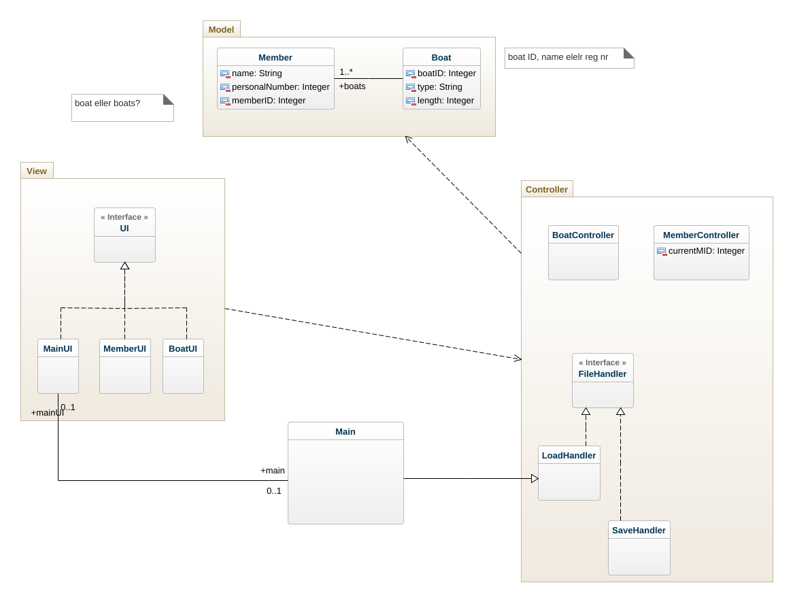
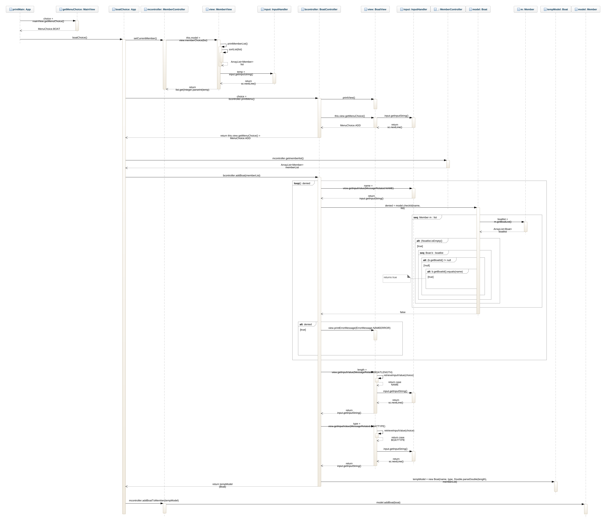
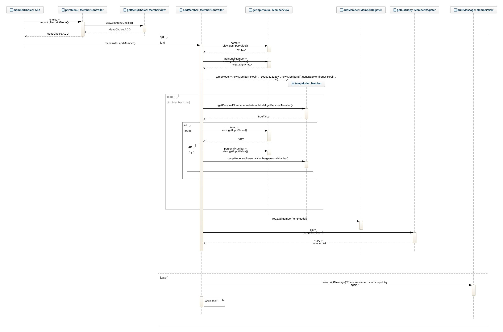
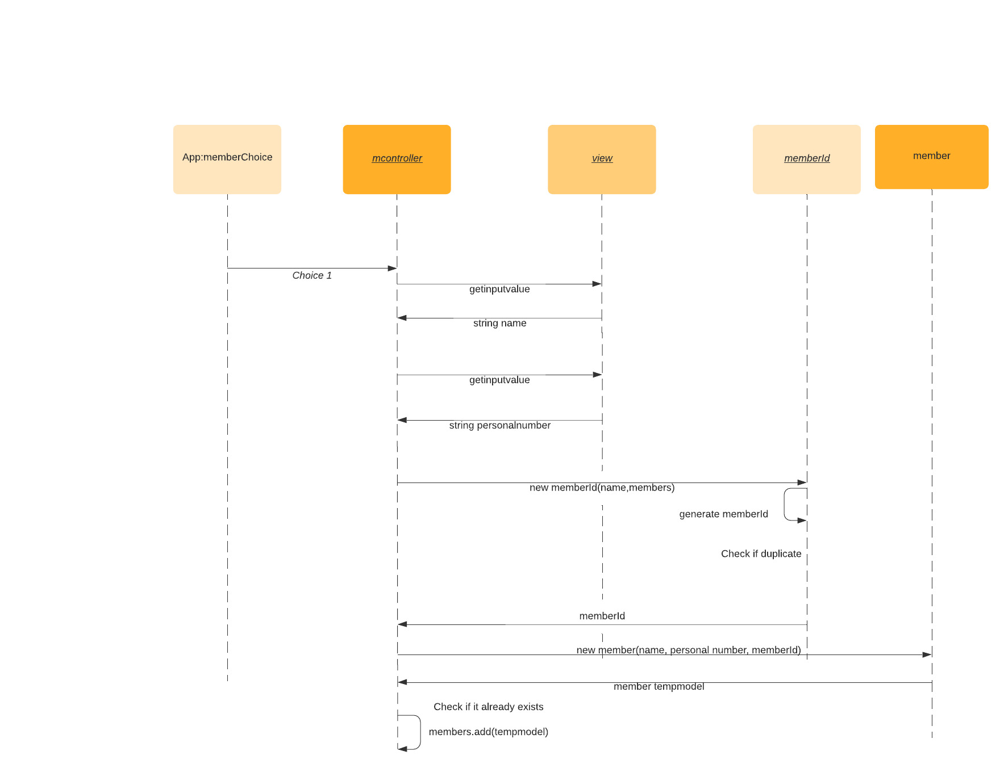

# Boatclub OO-Design
This document describes the design according to the requirements presented in assignment 2.

## Architectural Overview
The application uses the model-view-controller (MVC) architectural pattern. The view is passive and gets called from the controller. The view may only read information from the model, not directly change it.

## Detailed Design
### Class Diagram
Final class diagram 

Old final class diagram 2

Old final class diagram

First sketch after discussion 2021-09-28, class diagram.

### Sequence Diagram
Final sequence diagram

Old Final sequence diagram 2

Old Final sequence diagram for adding a member.

